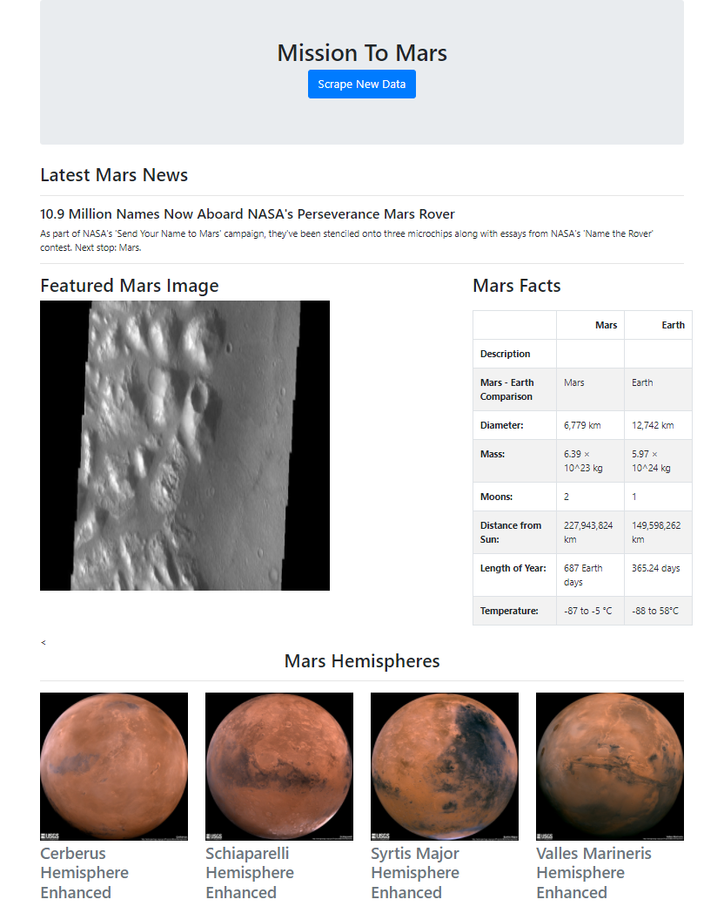

> <h1> Mission to Mars Web Scrapping </h1> 

<h1> Pre-requisites </h1>

 This needs Mongo DB. From Python it needs splinter,BeautifulSoup,ChromeDriverManager,Flask and Pymongo modules.
 It also needs Chrome browser installed. 

<h1> Execution Steps</h1>

 Run app.py to render a URL on your local host, which opens the web page. Click on "Scrape New Data" to see the magic.

  

